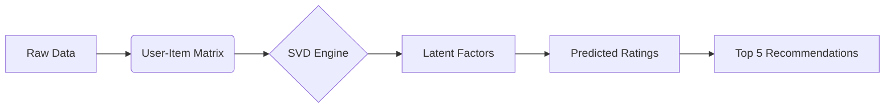

<div align="center">

# 🎬 T H E &nbsp;&nbsp; P R E D I C T O R
### *A Cinematic Intelligence System*

---


<br/>

> **"In a world of infinite choices, one algorithm decides what you watch next."**

</div>

---

## 📜 Cast & Crew (Metadata)

| Role | Details |
| :--- | :--- |
| **Director** | **JYOTSANA BHARDWAJ** |
| **Studio** | CODTECH IT SOLUTIONS |
| **ID** | CT08DK599 |
| **Genre** | Machine Learning (Recommendation Systems) |
| **Running Time** | 8 Weeks |
| **Executive Producer** | NEELA SANTOSH |

---

## 🎥 Act I: The Premise

We live in the age of streaming. Millions of movies, but only two hours on a Friday night. How do we choose?
**The Predictor** is not just code; it's a digital oracle. By analyzing the faint echoes of past ratings, it reconstructs the hidden matrix of human taste to surface the hidden gems you didn't know you loved.

It uses **Collaborative Filtering** powered by **Singular Value Decomposition (SVD)** to unzip the fabric of user-item interactions and peer into the future of your watchlist.

---

## 🎞️ Act II: The Architecture

The system is built on a tripod of data manipulation and linear algebra.

### 1. The Archives (`u.data`)
> *The raw logs of human interaction.*
Every row is a memory: A User, a Movie, a Rating, a Timestamp.

### 2. The Catalog (`u.item`)
> *The glossary of dreams.*
Mapping cryptic IDs to the titles we know and love (e.g., *Toy Story*, *GoldenEye*).

### 3. The Engine (`RecommendationSystem.py`)
> *The projection booth.*
Where the magic happens. We fracture the user-item matrix into three orthogonal matrices ($U, \Sigma, V^T$) to uncover latent factors—hidden genres, moods, and styles that define your taste.



---

## 🍿 Act III: The Screening (Usage)

To witness the oracle in action, follow these steps to set up your private screening room.

### 1. Assemble the Crew
Ensure your Python environment has the necessary stunt doubles:
```bash
pip install pandas numpy scikit-learn scipy
```

### 2. Roll Camera
Execute the script to train the model and generate predictions:
```bash
python RecommendationSystem.py
```

### 3. The Climax
The system will output the **RMSE (Root Mean Square Error)**—our measure of accuracy—and print the **Top 5 Movie Recommendations** for the test user.

> *"If you liked this README, you'll love the code."*

---

<div align="center">

### 🌟 Directed by Code. Produced by Logic. 🌟

</div>
